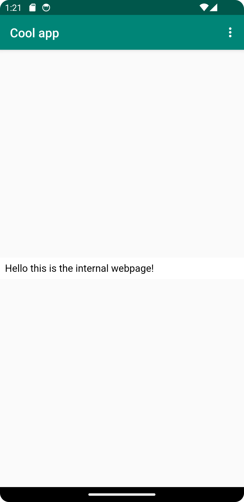
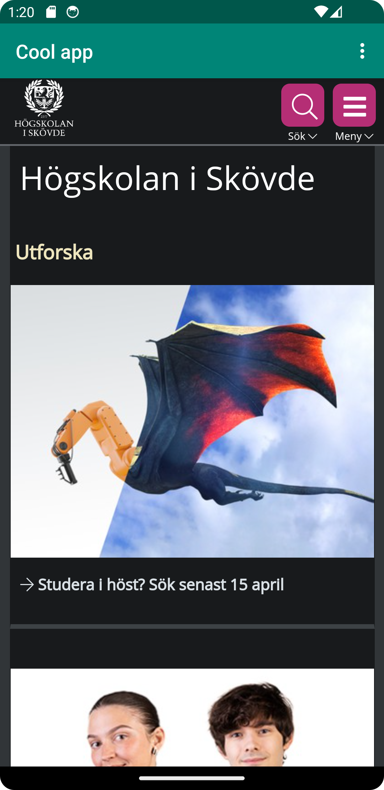

# Rapport

Jag har bytt ut TextView till WebView samt gett den ett ID. Därefter skapade jag en WebView 
member variable i MainActivity och assignade WebView ID:t till den. Jag skapade en ny 
WebViewClient och assignade den till WebViewen. Därefet laddade jag in his.se
på WebViewen och enablade javascript/internet access. Lade till about.html som internal webpage.

```
    protected void onCreate(Bundle savedInstanceState) {
        super.onCreate(savedInstanceState);
        setContentView(R.layout.activity_main);
        Toolbar toolbar = findViewById(R.id.toolbar);
        setSupportActionBar(toolbar);

        myWebView = findViewById(R.id.my_WebView);
        myWebView.setWebViewClient(new WebViewClient());
        myWebView.getSettings().setJavaScriptEnabled(true);
        myWebView.loadUrl("https://his.se");
```

Bilder läggs i samma mapp som markdown-filen.


